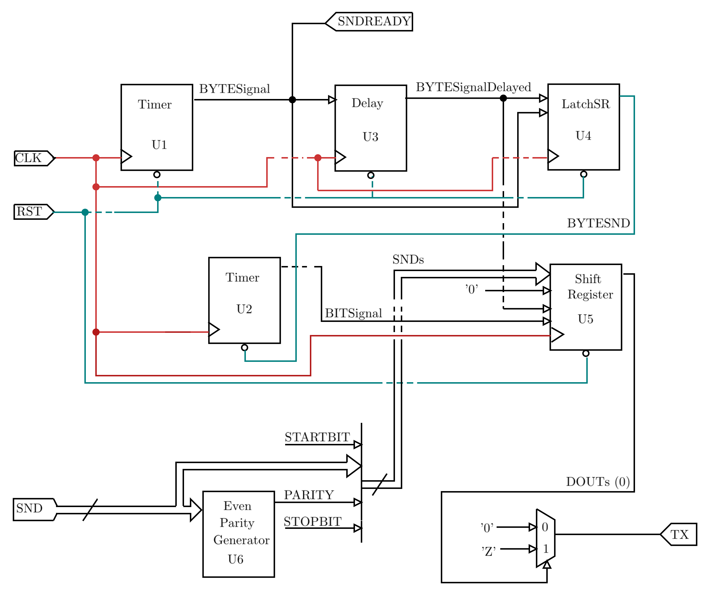

# UART transmitter  

The following diagram corresponds to the top level file. The clock signal net is shown in red, reset signal is shown in aqua. Thin signals correspond to a width of 1 bit, thick signals to a width of n bits.

The amount of resources consumed by this implementation are: <strong>92 LUTs + 80 FFs</strong> (Vivado 19.1).

## Note:
- Tx signal must be pulled up, conveniently internally.